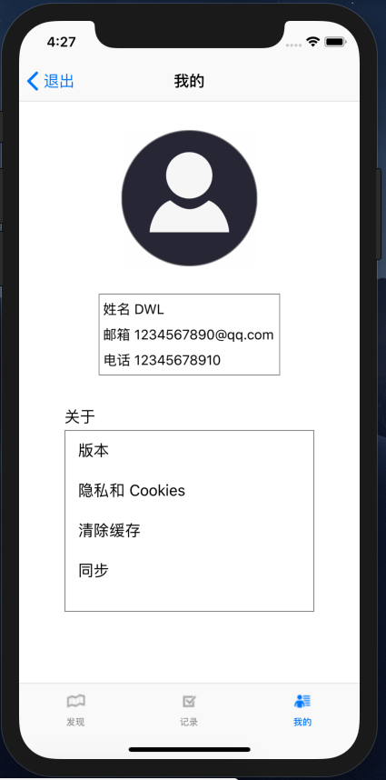

# HW2实验报告
## 介绍
UI组件布局及动画学习
## 开发环境
+ Mac OS
+ Objective-C
+ Xcode

**注：项目在xcode的iphone X模拟正常，若出现界面布局大小不合适的情况，请更换模拟设备为iphone X**
## 实验目的
+ 学习使用纯代码进行UI布局
+ 学习TableView，UICollectionView，UINavigationController，UICollectionController，UITabBarController等组件的使用，以及delegate和protocol的概念。
+ 学习使用UIView动画及Core Animation动画
## 项目要求
+ 发现页面包含一个搜索框、一个记录清单、一个添加按钮、一个底部导航
    + 页面的背景是渐变的，背景色从左上角到右下角渐变（颜色可自选）。
    + 底部的导航栏包含三个按钮，分别对应三个子页面，点击按钮切换到对应的页面。按钮在选中和未选中状态下图片和文字的颜色都不同。
    + 搜索框可以输入时间、地点、穿搭对记录进行快速检索。
    + 穿搭记录是一个可以滚动的列表，默认显示全部打卡记录。穿搭记录按时间倒序从上至下排列。滚动穿搭清单时，在清单下方加入0.5s的加载动画。
    + 每个穿搭记录为一个圆角矩形，点击某一个穿搭记录可跳转查看详细信息。
+ 编辑页面包含若干个单行输入框、一个多行输入框，图片选取及两个按钮。
    + 点击配图处的加号，可以从相册中选择图片上传并展示，按照每行三张图的方式显示，要求图片之间的边距相等。
    + 点击发布按钮，先展示动画效果再跳转到发现页面。动画效果可以设计为在屏幕中央显示一个发布成功的弹窗，持续时间0.5s，然后跳转到发现页面显示最新添加的打卡记录。
+ 点击发现页面的任一一个打卡记录，进入详情页面，自行设计一个转场动画。
+ 我的页面包含用户头像、用户基本信息以及APP的通用信息和功能。
    + 用户头像为圆形，居中显示。
+ 未登录时的我的页面只有一个圆形的登录按钮，登录按钮水平居中、垂直居中。登录页面的背景是渐变的，背景色从中心向四周渐变。
## 项目实现
项目代码部分结构如下：


**发现页面**：主要算法在DiscoverListViewController中定义

背景渐变的实现：
```
UIColor *topleftColor = [UIColor colorWithRed:135/255.0f green:206/255.0f blue:235/255.0f alpha:1.0f];
UIColor *bottomrightColor = [UIColor colorWithRed:255/255.0f green:255/255.0f blue:190/255.0f alpha:1.0f];
UIImage *bgImg = [self gradientColorImageFromColors:@[topleftColor, bottomrightColor] imgSize:self.view.bounds.size];
self.view.backgroundColor = [UIColor colorWithPatternImage:bgImg];
```
底部导航栏的组件分别由DiscoverContriller(发现)、CheckinController(记录)、ProfileController(我的)定义，这三个类都继承于UINavigationController。在ViewController的viewDidLoad函数中加载这三个组件，采用如下懒加载的方式：
```
- (DiscoverController *)discovery{
    if (_discovery == nil) {
        _discovery = [[DiscoverController alloc] init];
    }
    return _discovery;
}

- (CheckinController *)checkin{
    if (_checkin == nil) {
        _checkin = [[CheckinController alloc] init];
    }
    return _checkin;
}

- (ProfileController *)profile{
    if (_profile == nil) {
        _profile = [[ProfileController alloc] init];
    }
    return _profile;
}
```
由于导航栏中的“我的”按钮指向登陆前后两个页面，故在ProfileController中懒加载这两个页面的组件:
```
- (LoginViewController *)loginView {
    if (_loginView == nil) {
        _loginView = [[LoginViewController alloc] init];
        [_loginView setDelegate:self];
    }
    return _loginView;
}

- (ProfileViewController *)profileView {
    if (_profileView == nil) {
        _profileView = [[ProfileViewController alloc] init];
        [self setLoginDelegate:_profileView];
    }
    return _profileView;
}
```
搜索框的实现如下，也采用懒加载：
```
- (UITextField *)searchBox {
    if (_searchBox == nil) {
        _searchBox = [[UITextField alloc] initWithFrame:CGRectMake(self.view.bounds.origin.x + 10, self.view.bounds.origin.y + 110, self.view.bounds.size.width - 20, 30)];
        [_searchBox setPlaceholder:@"搜索框"];
        [_searchBox setDelegate:self];
        [_searchBox setReturnKeyType:UIReturnKeySearch];
        [_searchBox.layer setBorderWidth:1];
        [_searchBox.layer setBorderColor:UIColor.grayColor.CGColor];
    }
    return _searchBox;
}
```
使用UIView实现穿搭纪录列表上拉或下滑时0.5s的加载动画，添加多条记录和加快滑动速度可以使缩放动画明显些：
```
- (void)collectionView:(UICollectionView *)collectionView willDisplayCell:(UICollectionViewCell *)cell forItemAtIndexPath:(NSIndexPath *)indexPath {
    cell.transform = CGAffineTransformMakeScale(0.6, 0.6);
    [UIView animateWithDuration:0.5 delay:0.0 options:UIViewAnimationOptionCurveEaseInOut animations:^{
        cell.transform = CGAffineTransformIdentity;
    } completion:nil];
}
```
点击穿搭记录跳转到**详情界面**(DiscoverDetailViewController)时出现翻转动画，代码实现如下：
```
- (void)collectionView:(UICollectionView *)collectionView didSelectItemAtIndexPath:(NSIndexPath *)indexPath {
    CheckinModel* model = self.filteredDataArray[indexPath.row];
    DiscoverDetailViewController* detail = [[DiscoverDetailViewController alloc] initWithModel:model];
    CATransition *transition = [CATransition animation];
    transition.duration = 0.5;
    transition.type = @"oglFlip";
    transition.subtype = kCATransitionFromTop;
    [self.navigationController.view.layer addAnimation:transition forKey:nil];
    self.navigationController.navigationBarHidden = NO;
    [self.navigationController pushViewController:detail animated:true];
}
```
**编辑页面**：主要算法在DiscoverEditViewController中定义

懒加载时间、地点、搭配、心得、配图五个组件和提交按钮：
```
- (UICollectionView *)images {
    if (_images == nil) {
        UICollectionViewFlowLayout* layout = [[UICollectionViewFlowLayout alloc] init];
        [layout setItemSize:CGSizeMake((self.view.bounds.size.width - 120) / 3, (self.view.bounds.size.width - 120) / 3 * 0.8)];
        [layout setMinimumLineSpacing:10];
        [layout setMinimumInteritemSpacing:10];
        _images = [[UICollectionView alloc] initWithFrame:CGRectMake(80, 500, self.view.bounds.size.width - 100, self.view.bounds.size.height - 640) collectionViewLayout:layout];
        [_images setBackgroundColor:UIColor.clearColor];
        [_images registerClass:[UICollectionViewCell class] forCellWithReuseIdentifier:@"cell"];
        [_images setDelegate:self];
        [_images setDataSource:self];
    }
    
    return _images;
}

- (UITextView *)thoughtInput {
    if (_thoughtInput == nil) {
        _thoughtInput = [[UITextView alloc] initWithFrame:CGRectMake(120, 240, self.view.bounds.size.width - 140, 240)];
        [_thoughtInput setPlaceholder:@"多行输入" placeholdColor:[UIColor lightGrayColor]];
        [self.thoughtInput setText:@"1"];
        [self.thoughtInput setText:@""];
        [_thoughtInput.layer setBorderWidth:1];
        [_thoughtInput.layer setBorderColor:UIColor.grayColor.CGColor];
    }
    return _thoughtInput;
}

- (UITextField *)clothingInput {
    if (_clothingInput == nil) {
        _clothingInput = [[UITextField alloc] initWithFrame:CGRectMake(120, 200, self.view.bounds.size.width - 140, 30)];
        [_clothingInput setPlaceholder:@"单行输入"];
        [_clothingInput.layer setBorderWidth:1];
        [_clothingInput.layer setBorderColor:UIColor.grayColor.CGColor];
    }
    return _clothingInput;
}

- (UITextField *)placeInput {
    if (_placeInput == nil) {
        _placeInput = [[UITextField alloc] initWithFrame:CGRectMake(120, 160, self.view.bounds.size.width - 140, 30)];
        [_placeInput setPlaceholder:@"单行输入"];
        [_placeInput.layer setBorderWidth:1];
        [_placeInput.layer setBorderColor:UIColor.grayColor.CGColor];
    }
    return _placeInput;
}

- (UITextField *)dateInput {
    if (_dateInput == nil) {
        _dateInput = [[UITextField alloc] initWithFrame:CGRectMake(120, 120, self.view.bounds.size.width - 140, 30)];
        [_dateInput setPlaceholder:@"单行输入"];
        
        [_dateInput setText:[[CheckinModel getDateFormatter] stringFromDate:[NSDate dateWithTimeIntervalSinceNow:0]]];
        
        [_dateInput.layer setBorderWidth:1];
        [_dateInput.layer setBorderColor:UIColor.grayColor.CGColor];
    }
    return _dateInput;
}
- (UIButton *)addButton {
    if (_addButton == nil) {
        _addButton = [UIButton buttonWithType:UIButtonTypeSystem];
        [_addButton setTitle:@"提交" forState:UIControlStateNormal];
        [_addButton setFrame:CGRectMake(self.view.bounds.size.width/2 - 35, self.view.bounds.size.height - 130, 70, 30)];
        [_addButton.layer setBorderWidth:1];
        [_addButton.layer setBorderColor:UIColor.grayColor.CGColor];
        [_addButton addTarget:self action:@selector(handleTouch:) forControlEvents:UIControlEventTouchUpInside];
    }
    return _addButton;
}
```
由于心得使用的是UITextView没有Placeholder属性，为实现输入框中灰色占位符，在Views文件夹下增加UITextView+PlaceHolder，实现如下：
```
@implementation UITextView (Placeholder)

-(void)setPlaceholder:(NSString *)placeholdStr placeholdColor:(UIColor *)placeholdColor
{
    UILabel *placeHolderLabel = [[UILabel alloc] init];
    placeHolderLabel.text = placeholdStr;
    placeHolderLabel.numberOfLines = 0;
    placeHolderLabel.textColor = placeholdColor;
    placeHolderLabel.font = self.font;
    [placeHolderLabel sizeToFit];
    
    /*
     [self setValue:(nullable id) forKey:(nonnull NSString *)]
     ps: KVC键值编码，对UITextView的私有属性进行修改
     */
    if (HKVersion >= 8.3) {
        UILabel *placeholder = [self valueForKey:@"_placeholderLabel"];
        //防止重复
        if (placeholder) {
            return;
        }
        [self addSubview:placeHolderLabel];
        [self setValue:placeHolderLabel forKey:@"_placeholderLabel"];
    }
}

@end
```
点击加号选取图片上传的代码实现：
```
- (void)pickPhoto {
    UIImagePickerController *picker = [[UIImagePickerController alloc] init];
    picker.sourceType = UIImagePickerControllerSourceTypeSavedPhotosAlbum;
    picker.delegate = self;
    picker.allowsEditing = YES;
    [self presentViewController:picker animated:YES completion:nil];
}

- (void)imagePickerController:(UIImagePickerController *)picker didFinishPickingMediaWithInfo:(NSDictionary<UIImagePickerControllerInfoKey,id> *)info {
    [picker dismissViewControllerAnimated:YES completion:nil];
    
    UIImage *image = [info objectForKey:UIImagePickerControllerOriginalImage];
    [imageArray addObject:image];
    [self.images reloadData];
    [self.images reloadInputViews];
}
```
点击发布按钮先展示动画效果再跳转到发现页面的代码实现如下，增加了对记录是否填写完整的检查：
```
- (void)handleTouch:(UIButton *)button {
    CheckinModel *model = [[CheckinModel alloc] init];
    if ([[CheckinModel getDateFormatter] dateFromString:self.dateInput.text] == nil) {
        [self alertAnimation:self.dateInput];
        return;
    }
    [model setDate:[[CheckinModel getDateFormatter] dateFromString:self.dateInput.text]];
    if ([self.placeInput.text isEqualToString:@""]) {
        [self alertAnimation:self.placeInput];
        return;
    }
    [model setPlace:self.placeInput.text];
    if ([self.clothingInput.text isEqualToString:@""]) {
        [self alertAnimation:self.clothingInput];
        return;
    }
    [model setClothing:self.clothingInput.text];
    if ([self.thoughtInput.text isEqualToString:@""]) {
        [self alertAnimation:self.thoughtInput];
        return;
    }
    [model setThought:self.thoughtInput.text];
    NSMutableArray *array = [[NSMutableArray alloc] initWithArray:imageArray copyItems:true];
    [model setImages:array];
    [AppDelegate addCheckinRecord:model];
    
    [self.clothingInput setText:@""];
    [self.placeInput setText:@""];
    [self.thoughtInput setText:@""];
    [self.dateInput setText:[[CheckinModel getDateFormatter] stringFromDate:[NSDate dateWithTimeIntervalSinceNow:0]]];
    [imageArray removeAllObjects];
    [self.images reloadData];
    [self.images reloadInputViews];
    
    UILabel *label = [[UILabel alloc] init];
    label.text = @"发布成功";
    [label sizeToFit];
    label.center = self.view.center;
    label.backgroundColor = [UIColor blackColor];
    label.alpha = 0;
    label.textAlignment = NSTextAlignmentCenter;
    label.textColor = [UIColor whiteColor];
    label.font = [UIFont systemFontOfSize:15];
    label.layer.cornerRadius = 5;
    [self.view addSubview:label];
    [UIView animateWithDuration:0.5 animations:^{
        label.alpha = 1.0;
    } completion:^(BOOL finished) {
        [label removeFromSuperview];
        ViewController * parent = (ViewController *)[[self parentViewController] parentViewController];
        [parent setSelectedIndex:0];
    }];
}
```
**我的页面**：有登录前后两种

登录前由LoginViewController定义，背景颜色渐变效果代码实现如下：
```
UIColor *centerColor = [UIColor colorWithRed:135/255.0f green:206/255.0f blue:235/255.0f alpha:1.0f];
UIColor *outsideColor = [UIColor colorWithRed:255/255.0f green:255/255.0f blue:190/255.0f alpha:1.0f];
UIImage *bgImg = [self gradientColorImageFromColors:@[centerColor, outsideColor] imgSize:self.view.bounds.size];
self.view.backgroundColor = [UIColor colorWithPatternImage:bgImg];
```
登录后由ProfileViewController定义，展示用户头像、用户基本信息以及APP的通用信息和功能的组件采用懒加载：
```
- (UITextView *)infoView {
    if (_infoView == nil) {
        _infoView = [[UITextView alloc] initWithFrame:CGRectMake(self.view.bounds.size.width / 2 - 100, 300, 200, 90)];
        [_infoView.layer setBorderColor:UIColor.grayColor.CGColor];
        [_infoView.layer setBorderWidth:1];
        [_infoView setEditable:false];
        [self.view addSubview:_infoView];
    }
    
    return _infoView;
}

- (UIImageView *)avatarView {
    if (_avatarView == nil) {
        _avatarView = [[UIImageView alloc] initWithFrame:CGRectMake(self.view.bounds.size.width / 2 - 75, 120, 150, 150)];
        _avatarView.layer.masksToBounds = YES;
        _avatarView.layer.cornerRadius = 75;
        [_avatarView.layer setBorderWidth:1];
        _avatarView.layer.borderColor=[UIColor grayColor].CGColor;
        [self.view addSubview:_avatarView];
    }
    return _avatarView;
}

- (UITableView *)menuTable {
    if (_menuTable == nil) {
        _menuTable = [[UITableView alloc] initWithFrame:CGRectMake(50, 450, self.view.bounds.size.width - 100, 200)];
        [_menuTable.layer setBorderColor:UIColor.grayColor.CGColor];
        [_menuTable.layer setBorderWidth:1];
        [_menuTable setSeparatorStyle:UITableViewCellSeparatorStyleNone];
        [self.view addSubview:_menuTable];
        _menuTable.dataSource = self;
    }
    return _menuTable;
}
```
## 软件界面展示
### 发现页面
运行后初始界面如下,此时没有穿搭记录


添加一条记录后发现界面如下


添加多条记录后,在发现页面按时间倒序显示穿搭记录列表.穿搭纪录列表上拉或下滑时有0.5s的加载动画缩放，添加多条记录和加快滑动速度可以使缩放动画明显些


搜索框输入时间对记录进行快速检索:


搜索框输入地点对记录进行快速检索:


搜索框输入穿搭对记录进行快速检索:


### 详细页面
点击一条记录,经翻转特效后进入详细页面


### 编辑页面
点击导航栏记录按钮,进入编辑页面并自动填入当天日期


删掉填入的日期


填好穿搭记录


### 我的页面
登录前


点击中间按钮登录后


